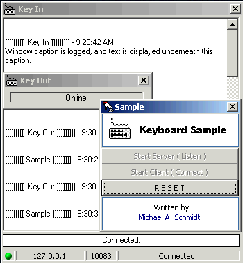



## ActiveX Network Keylog Control

### Description

A basic network keylog utility allowing you to capture keystrokes from a remote computer, provided both are running the application.

Hope you find it useful, post any bugs, comments, or votes =)
 
### More Info
 

             |
---                |---
**Submitted On**   |2001-10-12 09:41:32
**By**             |[Michael A\. Schmidt](https://github.com/Planet-Source-Code/PSCIndex/blob/master/ByAuthor/michael-a-schmidt.md)
**Level**          |Advanced
**User Rating**    |5.0 (20 globes from 4 users)
**Compatibility**  |VB 6\.0
**Category**       |[OLE/ COM/ DCOM/ Active\-X](https://github.com/Planet-Source-Code/PSCIndex/blob/master/ByCategory/ole-com-dcom-active-x__1-29.md)
**World**          |[Visual Basic](https://github.com/Planet-Source-Code/PSCIndex/blob/master/ByWorld/visual-basic.md)
**Archive File**   |[ActiveX Ke2871510122001\.zip](https://github.com/Planet-Source-Code/michael-a-schmidt-activex-network-keylog-control__1-28021/archive/master.zip)

